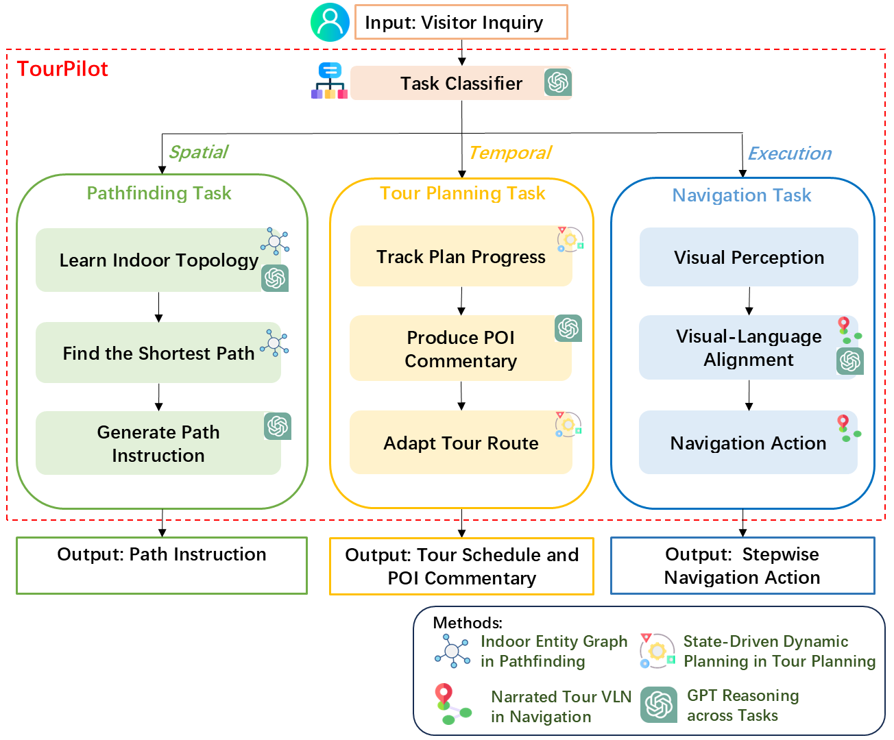

# TourPilot

**TourPilot** is an LLM-powered indoor tour guidance system that unifies pathfinding, adaptive tour planning, and real-time navigation into a single intelligent framework. Designed for dynamic indoor spaces like museums and shopping malls, it delivers personalized tour experiences without relying on infrastructure-based localization.

## Key Features

- **Indoor Entity Graph for Pathfinding**  
  Encodes semantic entities and spatial relationships to support LLM-based topological navigation in complex environments.

- **State-Driven Dynamic Planning for Tour Planning**  
  Models each point of interest (POI) as a state and dynamically adapts the tour plan based on real-time visitor preferences and inputs.

- **Narrated Tour VLN for Navigation**  
  Interprets natural language instructions and panoramic visual input to perform navigation and deliver contextual commentary,without needing prior mapping or sensors.

- **Validated in Real-World Scenarios**  
  Demonstrated in CF Market Mall, Studio Bell Museum, and an art studio, showing comparable performance to human tour guides.

This repository provides the indoor navigation case in an art studio, serving as a demonstration of our navigation method.

 .

## Installation
1. Matterport3D installation instruction: [here](https://github.com/peteanderson80/Matterport3DSimulator). 
2. Install requirements:
```setup
conda create -n TourPilot python=3.10
conda activate TourPilot
pip install -r requirements.txt
```

## OpenAI API key
Fill in your API key at Line 12 of the file: GPT/api.py.


## Set the PYTHONPATH to Include the Project Directory.
```bash
export PYTHONPATH=$PYTHONPATH:/path/to/your/TourPilot
```
## Run TourPilot
```bash
bash scripts/gpt4o.sh
```


